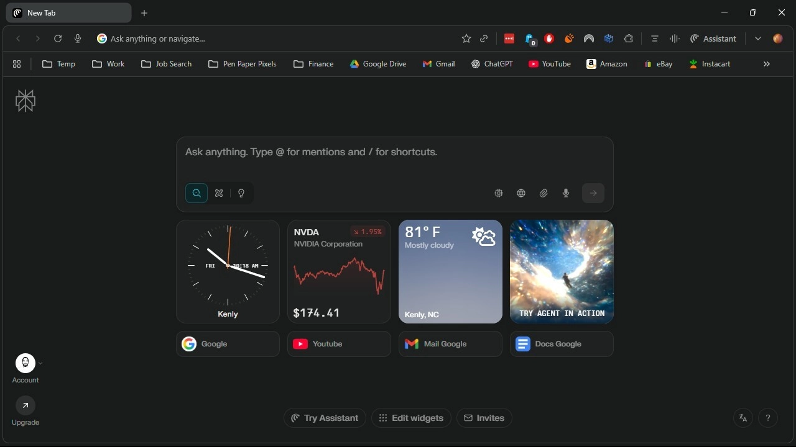

# Perplexity的AI浏览器Comet全面免费开放，手机版即将上线

---

你是不是也觉得，每次想用个新工具，结果发现要先掏200美元订阅费？这种感觉就像去餐厅吃饭，服务员说"想看菜单？先办会员"。好消息是，Perplexity终于想通了——他们的AI浏览器Comet现在对所有人免费开放了。

这意味着什么？你不用再为了体验AI搜索+传统浏览的组合功能，每个月掏一大笔钱。更重要的是，手机版也在路上了，到时候你在地铁上、咖啡馆里，随时都能用上这个工具。

---

## Comet是什么？为什么值得关注

Perplexity是最早推出AI浏览器的公司之一。他们把自家的AI搜索助手和普通浏览器功能塞进了一个工具里，起名叫Comet。

之前想用？得先订阅他们最贵的Max套餐，每月200美元。现在不用了，直接去Perplexity官网下载就行，桌面版已经上线。

不过有个小细节：它还没上架苹果的macOS App Store或微软的Windows应用商店。你得从官网手动下载安装包，稍微麻烦一点，但也不是什么大问题。

---

## 手机版要来了，随时随地用AI

Perplexity说他们正在开发移动应用，很快就会发布。从官方的说法来看，iPhone和安卓版本应该都在计划里。

这个消息其实挺重要的。现在大部分人用手机的时间比电脑多得多。你在路上突然想查个东西，或者需要快速整理信息，掏出手机就能搞定，比打开电脑方便太多了。

---

## 新功能：后台助手和邮件助手

Perplexity最近还推出了一个叫"后台助手"的功能。简单说，就是AI在后台帮你同时处理多个任务，你不用盯着屏幕等结果。

比如你想研究三个不同的话题，或者需要整理一堆资料，后台助手可以同时开工，你该干嘛干嘛。Perplexity的说法是"把你的好奇心变成生产力"——听起来有点夸张，但确实解决了一个痛点：等AI处理任务的时间。

另一个新功能是邮件助手，不过这个只对Max订阅用户开放。你可以把邮件抄送给AI，让它帮你安排会议、研究话题或者起草回复。对于每天被邮件淹没的人来说，这功能应该挺实用。

👉 [想了解更多AI工具如何提升工作效率？点这里看看Perplexity的完整功能](https://pplx.ai/ixkwood69619635)

---

## Comet Plus：付费用户的额外福利

如果你订阅了Perplexity Pro或Max，还能用上Comet Plus功能。这个服务有点像Apple News+，会给你推送精选的新闻内容。

合作的媒体包括CNN、Conde Nast、《财富》杂志、《洛杉矶时报》、《华盛顿邮报》等等。如果你没有Perplexity订阅，单独订阅Comet Plus的话，每月5美元。

说实话，这个价格还算合理。比起那些动不动就十几美元的新闻订阅服务，5美元能看到这么多主流媒体的内容，性价比不错。

---

## Perplexity的野心：收购其他浏览器

有意思的是，Perplexity今年一直在尝试收购其他浏览器。他们出价想买Brave和DuckDuckGo，甚至还向谷歌开价345亿美元想买Chrome。

不过Chrome那个报价，外界普遍认为是炒作。毕竟谷歌现在已经不用卖掉Chrome了，这事儿基本凉了。

但这些动作也说明了一件事：Perplexity对浏览器市场是认真的。他们不只是想做一个AI搜索工具，而是想在浏览器领域占据一席之地。

---

## 值得试试吗?

如果你对AI工具感兴趣，或者想找一个能把搜索和浏览结合起来的工具，Comet值得一试。毕竟现在免费了，不用花钱就能体验完整功能。

当然，它也不是完美的。比如还没上架应用商店，安装稍微麻烦一点。手机版也还没出来,得再等等。但对于一个刚开放不久的产品来说,这些都是可以理解的。

最关键的是,Perplexity在AI浏览器这条路上走得挺坚定。从收费到免费,从桌面到移动,他们在一步步扩大覆盖范围。如果你想提前体验AI浏览的未来,现在就是个不错的时机。

---

Comet的全面开放,标志着AI浏览器正在从小众工具变成普通人都能用上的产品。不管是桌面办公还是移动场景,AI助手都能帮你更高效地处理信息。👉 [想体验AI如何改变你的浏览习惯?现在就试试Perplexity](https://pplx.ai/ixkwood69619635),看看它能为你的日常工作带来什么改变。
